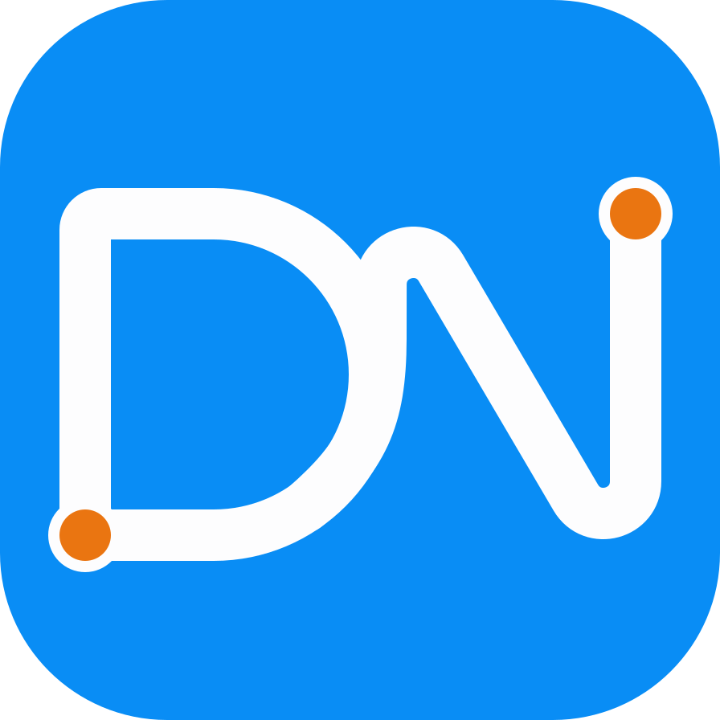
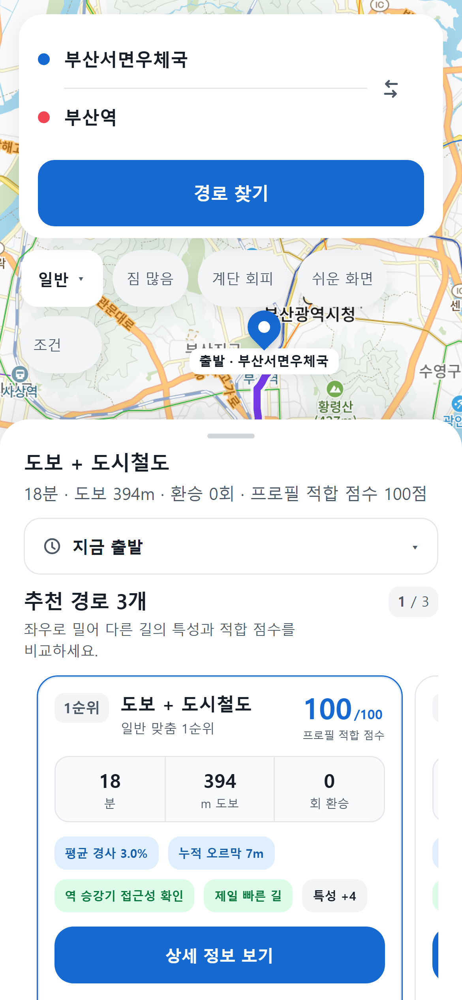
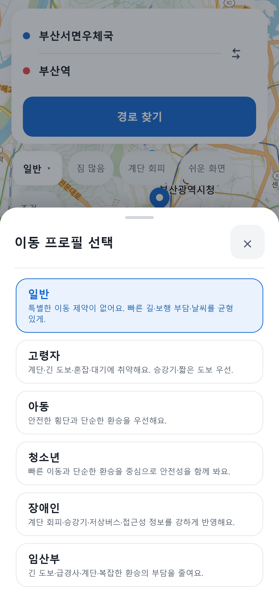
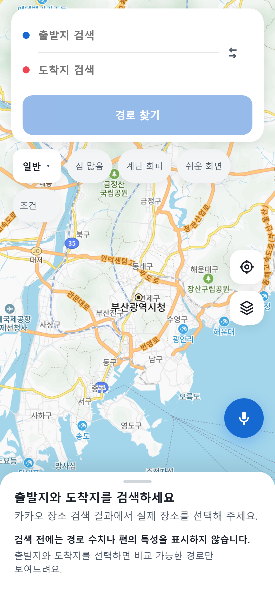
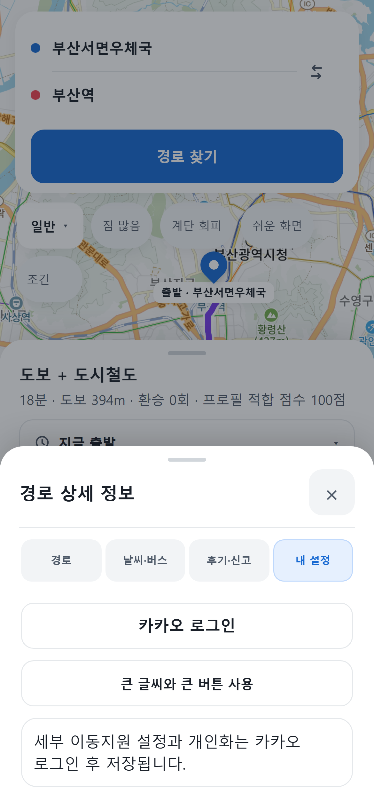
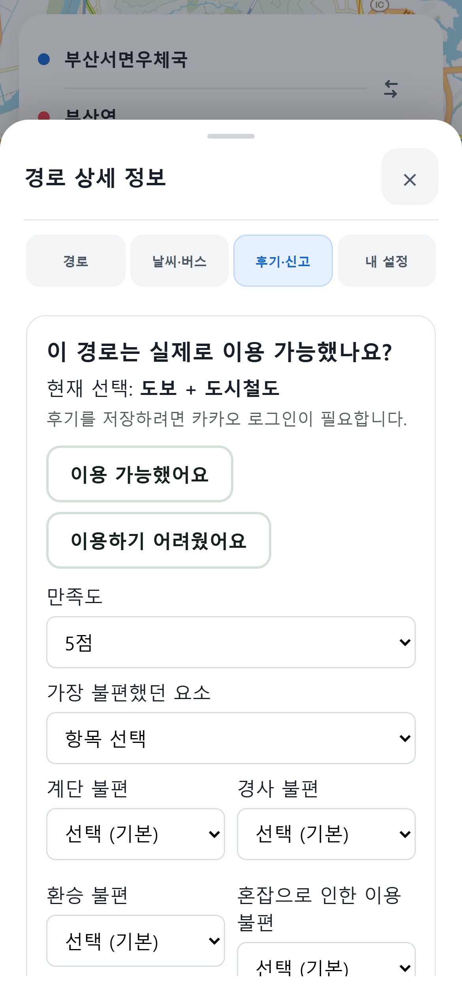
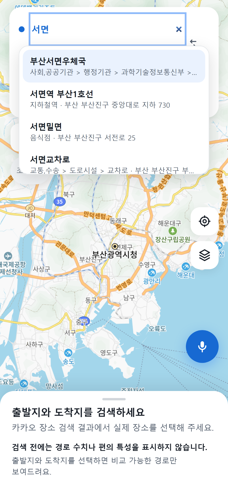
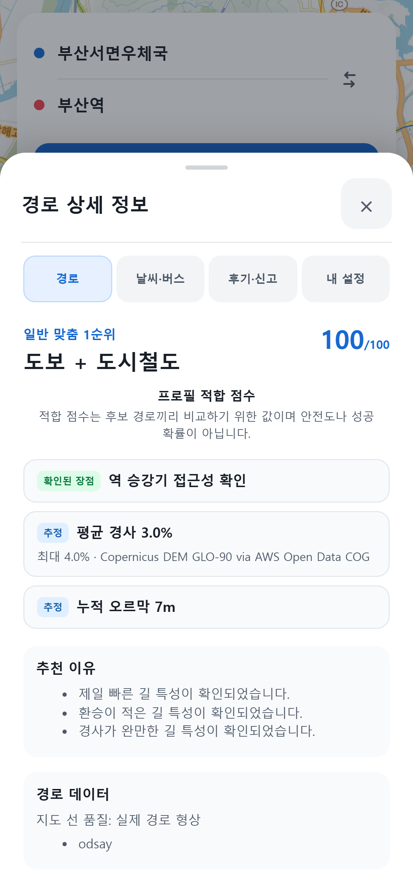
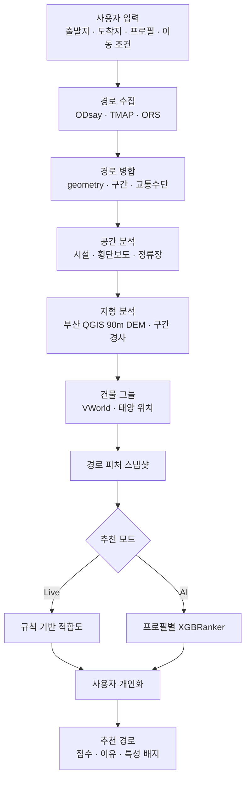
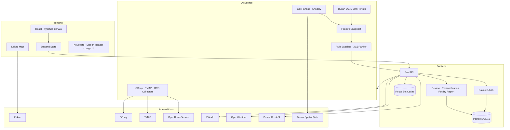

<div align="center">



# 동넷

### 🧭 부산 교통약자·이동취약자 맞춤형 경로 추천 PWA

사용자 프로필과 이동 조건을 바탕으로 부산의 보행·대중교통 경로를 비교합니다.  
경사, 건물 그늘, 환승, 계단, 승강기, 저상버스와 휠체어 이동 조건을 지도와 경로 카드에서 함께 확인할 수 있습니다.

<br />

🌐 **Live Demo** · [dongnet.kr](https://dongnet.kr)

📖 [Product Decisions](./docs/PRODUCT_DECISIONS.md) ·
🏗️ [Implementation](./docs/IMPLEMENTATION.md) ·
🗺️ [Map-first UI](./frontend/src/v2/README.md) ·
📚 [Documentation](#-documentation)

<br />

[](https://github.com/LxNx-Hn/KT-10/actions/workflows/ci.yml)


</div>

---

## 📌 Overview

<table>
  <tr>
    <td width="42%" valign="middle" align="center">
      
    </td>
    <td width="58%" valign="middle">
      <h3>부산 맞춤형 경로 추천</h3>
      <p>프로필과 이동 조건에 맞춰 부산의 보행·대중교통 경로를 비교합니다.</p>
      <p>경사, 그늘, 환승, 계단, 승강기, 저상버스 정보를 지도와 카드에서 함께 확인할 수 있습니다.</p>
      <br/>
      <ul>
        <li><b>👤 사용자 프로필</b> : 6종 지원</li>
        <li><b>⚙️ 이동 보조 조건</b> : 검색 조건과 장기 이동지원 설정</li>
        <li><b>🗺️ 공간 데이터 레이어</b> : 12종 분석 인프라</li>
      </ul>
    </td>
  </tr>
</table>

<div align="center">

| 380 | 1,137 | 6,822 |
| :---: | :---: | :---: |
| 부산 OD | 실제 경로 후보 | 프로필 평가 |

</div>

---

## 📱 App Screens

### 01. 출발지와 도착지 검색

<table>
  <tr>
    <td width="42%" align="center" valign="middle">
      
    </td>
    <td width="58%" valign="middle">
      <h4>🔎 장소 검색</h4>
      <ul>
        <li>Kakao Places 검색 API 연동</li>
        <li>키보드 자동완성 지원</li>
        <li>현재 위치 실시간 설정</li>
        <li>출발지·도착지 1-Click 교환</li>
      </ul>
    </td>
  </tr>
</table>

### 02. 프로필과 이동 조건 선택

<table>
  <tr>
    <td width="58%" valign="middle">
      <h4>👤 맞춤 조건</h4>
      <ul>
        <li>일반 · 고령자 · 아동</li>
        <li>청소년 · 장애인 · 임산부</li>
        <li>짐 많음 · 유아차 동반</li>
        <li>계단 회피 · 그늘 우선</li>
        <li>저상버스 우선 · 환승 최소</li>
      </ul>
    </td>
    <td width="42%" align="center" valign="middle">
      
    </td>
  </tr>
</table>

### 03. 추천 경로 비교

<table>
  <tr>
    <td width="42%" align="center" valign="middle">
      
    </td>
    <td width="58%" valign="middle">
      <h4>🧭 결과 시트 경로 목록</h4>
      <ul>
        <li>프로필 적합 점수 산출</li>
        <li>소요시간 · 도보거리 · 환승 계산</li>
        <li>경사 · 그늘 · 계단 정보 시각화</li>
        <li>추천 이유 및 맞춤 특성 배지</li>
      </ul>
    </td>
  </tr>
</table>

### 04. 카드와 지도 동기화

<table>
  <tr>
    <td width="58%" valign="middle">
      <h4>🗺️ Map-first UI</h4>
      <ul>
        <li>결과 시트 세로 목록에서 카드 선택 시 지도 경로 동기화</li>
        <li>결과 시트 드래그·3단계 snap 제스처</li>
        <li>목록 내부 세로 스크롤 우선, 시트 제스처의 배경 지도 비전파</li>
        <li>클릭·키보드·스크린리더 기반 경로 선택</li>
      </ul>
    </td>
    <td width="42%" align="center" valign="middle">
      
    </td>
  </tr>
</table>

### 05. 시간대별 건물 그늘

<table>
  <tr>
    <td width="42%" align="center" valign="middle">
      
    </td>
    <td width="58%" valign="middle">
      <h4>☀️ Shade View</h4>
      <ul>
        <li>출발시각 맞춤 선택</li>
        <li>VWorld 정밀 건물 정보 연동</li>
        <li>태양 고도·방위각 실시간 계산</li>
        <li>보행로 쾌적 그늘 구간 오버레이</li>
      </ul>
    </td>
  </tr>
</table>

### 06. 경로 상세 정보

<table>
  <tr>
    <td width="58%" valign="middle">
      <h4>📋 Route Details</h4>
      <ul>
        <li>AI / 규칙 기반 추천 근거 분석</li>
        <li>경로별 구간 특성 하이라이트</li>
        <li>교통수단별 세부 이동 동선</li>
        <li>공공 데이터 출처 투명 표기</li>
      </ul>
    </td>
    <td width="42%" align="center" valign="middle">
      
    </td>
  </tr>
</table>

### 07. 날씨와 버스 도착 정보

<table>
  <tr>
    <td width="42%" align="center" valign="middle">
      
    </td>
    <td width="58%" valign="middle">
      <h4>🌦️ Live Information</h4>
      <ul>
        <li>실시간 기상 환경 및 미세먼지 측정</li>
        <li>주변 버스 정류장 통합 검색</li>
        <li>실시간 버스 도착 예정 정보 연동</li>
        <li>이동 제약 조건 연계 안내</li>
      </ul>
    </td>
  </tr>
</table>

### 08. 로그인과 사용자 설정

<table>
  <tr>
    <td width="58%" valign="middle">
      <h4>🔐 User Profile</h4>
      <ul>
        <li>비로그인 시작과 선택적 Kakao 간편 로그인</li>
        <li>가입 시 이용약관 확인과 동의</li>
        <li>휠체어·보행보조기·최대 도보거리 등 이동지원 설정 저장</li>
        <li>사용자 선호 데이터 기반 개인화</li>
        <li>이용약관·개인정보처리방침·회원 탈퇴 제공</li>
      </ul>
    </td>
    <td width="42%" align="center" valign="middle">
      
    </td>
  </tr>
</table>

### 09. 후기와 시설 신고

<table>
  <tr>
    <td width="42%" align="center" valign="middle">
      
    </td>
    <td width="58%" valign="middle">
      <h4>💬 Feedback</h4>
      <ul>
        <li>경로 만족도 및 재이용 의향 피드백</li>
        <li>시설물 위치 및 운영 상태 오차 신고</li>
        <li>관리자 수동 검토와 처리 상태·근거 기록</li>
      </ul>
    </td>
  </tr>
</table>

### 10. 모바일·반응형 UI

<table>
  <tr>
    <td width="33%" align="center" valign="top">
      <br/><br/>
      <sub><b>모바일 검색</b></sub>
    </td>
    <td width="33%" align="center" valign="top">
      <br/><br/>
      <sub><b>경로 카드 비교</b></sub>
    </td>
    <td width="33%" align="center" valign="top">
      <br/><br/>
      <sub><b>경로 상세 Drawer</b></sub>
    </td>
  </tr>
</table>

---

## ✨ Key Features

<table>
  <tr>
    <td width="50%" valign="top">
      <h3>🗺️ Map-first UI</h3>
      <p>검색, 추천 카드, 지도 경로, 상세 정보를 하나의 모바일 화면에서 이어서 확인할 수 있습니다.</p>
    </td>
    <td width="50%" valign="top">
      <h3>🧠 Profile-aware Ranking</h3>
      <p>6개 프로필과 6개 이동 조건을 경로 피처와 함께 계산해 적합도 순으로 정렬합니다.</p>
    </td>
  </tr>
  <tr>
    <td width="50%" valign="top">
      <h3>📍 Real Route Providers</h3>
      <p>일반 경로는 ODsay·TMAP, 휠체어 경로는 ODsay·OpenRouteService를 사용해 실제 geometry와 구간 정보를 수집합니다.</p>
    </td>
    <td width="50%" valign="top">
      <h3>⛰️ Terrain Analysis</h3>
      <p>QGIS에서 90m 격자로 전처리한 부산 DEM을 메모리에 적재해 평균 경사, 최대 경사, 누적 오르막과 구간별 경사를 계산합니다.</p>
    </td>
  </tr>
  <tr>
    <td width="50%" valign="top">
      <h3>☀️ Building Shade</h3>
      <p>VWorld 건물 정보와 태양 위치를 이용해 출발시각별 건물 그늘 구간을 계산합니다.</p>
    </td>
    <td width="50%" valign="top">
      <h3>📊 Spatial Features</h3>
      <p>쉼터, CCTV, AED, 휠체어 충전기, 이동지원센터, 복지시설, 배리어프리 관광지 등 12개 공간 레이어를 경로 피처로 연결합니다.</p>
    </td>
  </tr>
  <tr>
    <td width="50%" valign="top">
      <h3>💡 Route Explanation</h3>
      <p>빠른 길, 짧은 도보, 완만한 경사, 많은 그늘, 적은 환승 등 경로 특성을 카드에 표시합니다.</p>
    </td>
    <td width="50%" valign="top">
      <h3>♿ Accessible Interaction</h3>
      <p>큰 글씨, 키보드·스크린리더 조작과 함께 음성 목적지 검색, 조건 변경, 경로 설명·선택을 제공합니다.</p>
    </td>
  </tr>
</table>

---

## 🧠 How It Works



### 추천 흐름

1. Kakao Places에서 출발지와 도착지를 선택합니다.
2. 일반 경로는 ODsay·TMAP, 휠체어 경로는 ODsay·ORS에서 후보를 수집합니다.
3. 휠체어 후보는 계단·노면·폭·턱·경사와 대중교통 접근 조건을 확인하고, 경로 geometry와 교통수단별 구간을 하나의 후보 구조로 정리합니다.
4. 경로 주변 공간 데이터와 부산 QGIS 90m DEM 지형 정보를 계산합니다.
5. 출발시각에 맞춰 건물 그늘을 계산합니다.
6. 프로필과 이동 조건을 기준으로 경로 순위를 정합니다.
7. 로그인 사용자의 개인화 값을 함께 반영합니다.
8. 지도와 경로 카드에 추천 결과를 표시합니다.

---

## 🗺️ Data & Maps

### 공간 데이터

| 레이어 | 활용 |
|---|---|
| 무더위·한파 쉼터 | 경로 주변 쉼터 확인 |
| CCTV | 경로 1km당 카메라 밀도 |
| AED | 경로 주변 AED 확인 |
| 전동휠체어 충전기 | 경로 주변 충전기 확인 |
| 교통약자 이동지원센터 | 센터 위치와 지원 차량 정보 |
| 장애인복지시설 | 시설 위치와 목적지 정보 |
| 배리어프리 문화·관광지 | 제공된 편의시설 정보 |
| 동백전 생활 인프라 | 경로 주변 생활 인프라 |
| 스마트 버스쉘터 | 쉘터와 냉방 정보 |
| 도시철도 접근성 | 역 승강기 접근 정보 |
| 횡단보도·신호 | 횡단보도 수와 신호 비율 |
| 버스 정류장 | 경로 주변 정류장 수 |

정적 공간 레이어는 `EPSG:5179`로 준비하고 Shapely STRtree 공간 인덱스를 사용합니다. 경로 주변 50m·200m 범위에서 필요한 시설과 환경 정보를 조회합니다.

### 외부 서비스

| 서비스 | 역할 |
|---|---|
| Kakao Maps / Local | 지도와 장소 검색 |
| ODsay | 대중교통 경로와 노선 geometry |
| TMAP | 일반 보행 경로와 사전 수집한 물리 경사로 근거 |
| OpenRouteService | 휠체어 보행 경로와 통행 제약 적용 |
| OSMnx | 보행 geometry 캐시 |
| 부산 QGIS 90m DEM | 운영 경로의 고도와 구간별 경사 |
| Open-Meteo Copernicus GLO-90 | 지역 DEM 범위 밖 fallback 고도 |
| VWorld | 건물 도형과 높이 |
| OpenWeather | 현재 날씨 |
| 부산 버스 API | 정류장과 버스 도착 정보 |
| NVIDIA NIM | 확인된 경로 사실의 음성 설명 보강 |

자세한 데이터 목록은 [`data/catalog.json`](./data/catalog.json)에서 확인할 수 있습니다.

---

## 🤖 AI & Ranking

### 입력 피처

- 평균·최대·최소 경사
- 경사 분포와 누적 오르막
- 계단 수와 승강기 비율
- 환승 횟수
- 도보거리와 총 소요시간
- 저상버스 정보
- 건물 그늘 비율과 그늘 도보거리
- CCTV·횡단보도·쉼터·AED·충전기·정류장
- 기온·체감온도·강수·바람·미세먼지
- 짐, 유아차, 계단 회피, 그늘 우선, 저상버스 우선, 환승 최소와 장기 이동지원 설정

### 모델 구성

| 항목 | 결과 |
|---|---:|
| 프로필별 모델 | 6개 |
| 전체 OD | 380개 |
| 실제 경로 후보 | 1,137개 |
| 프로필 평가 | 6,822개 |
| 프로필별 학습 OD | 304개 |
| 프로필별 검증 OD | 76개 |
| NDCG@3 | 0.9166–0.9596 |
| 후보쌍 정확도 | 0.6806–0.8315 |

모델 artifact는 manifest와 프로필별 XGBoost JSON을 담은 ZIP 형식입니다.
현재 배포 기준선은 초기 평가 데이터로 학습한 `bootstrap_baseline`이며,
사람 평가와 관리자 수동 승격을 마친 `human_validated` 운영 모델은 아직
없습니다. 표시 점수는 후보 간 상대 적합도이며 안전도나 통행 성공확률이 아닙니다.

### 접근성 데이터 한계

- ORS는 OpenStreetMap에 기록된 정보로 제약을 적용하므로 미등록 계단·턱을 놓칠 수 있습니다.
- 명시적으로 경사로가 없다고 확인된 계단 선형은 휠체어 후보에서 제외하지만, 태그 누락을 통행 가능으로 추정하지 않습니다.
- 공사·적치물·고장·문이나 게이트의 실제 개방 상태 같은 임시 장애물은 확인하지 못할 수 있습니다.
- 90m DEM 경사는 보도 실측 구배가 아니며, 건물 그늘에는 나무·지형 그림자가 포함되지 않습니다.

---

## 🏗️ Architecture



### Production 구성

```text
PostgreSQL
    ↓
AI Route Pipeline
    ↓
FastAPI Backend
    ↓
Nginx + React PWA
```

로컬·단일 서버에서는 Docker Compose로 전체 서비스를 실행합니다. 운영 배포는
GitHub Actions가 이미지를 ECR에 올리고 ECS의 AI·Backend·Frontend 서비스를
갱신하며, ALB가 `dongnet.kr`의 HTTPS 요청을 전달합니다.

---

## ✅ Engineering

### 테스트

AI·Backend·Frontend 단위 테스트와 PostgreSQL 마이그레이션, Playwright
접근성·실제 장소검색·법적 문서 흐름, 프로덕션 빌드와 보안 검사를 운영 CI에
연결했습니다.

### GitHub Actions

- AI Pytest
- Backend Pytest + PostgreSQL
- Frontend Vitest
- TypeScript production build
- Playwright 접근성 테스트
- Alembic migration upgrade/check
- Ruff
- Bandit
- pip-audit
- npm audit
- Docker production image build
- Production Compose 기동 검사
- UTF-8·JSON·JSONL repository contract 검사

### Production runtime

- PostgreSQL 16 healthcheck
- AI·Backend·Frontend healthcheck
- 비루트 컨테이너
- Linux capability 제거
- `no-new-privileges`
- Backend read-only root filesystem
- Loopback-bound application port
- 외부 HTTPS reverse proxy 구성
- 공급자별 영구 캐시

### 요청 최적화

- 동일 좌표·조건 요청은 공급자 캐시와 single-flight를 함께 사용
- ODsay는 2초 동안 우선 사용하고, 지연 시에만 TMAP을 병렬 시작해 대중교통 공급자 대기를 10초로 제한
- 선택적 독립 보행 후보가 지연돼도 11초 안에 확보한 실제 대중교통 후보를 반환하고, TMAP 보행 선형 보완은 구간당 2.5초로 제한
- ODsay 정밀 노선 geometry는 1위 후보만 먼저 준비하고 나머지는 선택 시 조회
- 그늘 시각 변경은 후보를 다시 수집하지 않고 같은 후보군의 그늘과 순위만 갱신
- 휠체어 요청은 ORS 보행 구간을 중복 호출하지 않고, TMAP 경사로 근거는 사전 수집 캐시만 사용

---

## 🧰 Tech Stack

| 분야 | 기술 |
|---|---|
| Frontend | React 18 · TypeScript · Vite · Zustand · Vite PWA |
| Map | Kakao Maps JavaScript SDK |
| Backend | FastAPI · Pydantic · SQLAlchemy · Alembic |
| Database | PostgreSQL 16 · Psycopg |
| AI | XGBoost XGBRanker · Scikit-learn |
| Geospatial | GeoPandas · Shapely · Rasterio · OSMnx · NetworkX |
| Data | Pandas · NumPy · OpenPyXL |
| Testing | Pytest · Vitest · Testing Library · Playwright · axe-core |
| Infrastructure | Docker Compose · Nginx · AWS ECR/ECS/ALB · GitHub Actions |

---

## 👥 Team

<div align="center">

### 9 Members · 3 Tracks

**PM 1 · AI 4 · DA 4**

</div>

PM은 제품 범위와 검증 기준을 관리하고, AI 트랙은 실제 경로 수집·피처·순위화,
DA 트랙은 부산 공간 데이터의 수집·정규화·출처 검증을 담당합니다.

---

## 📚 Documentation

| 분류 | 문서 | 내용 |
|---|---|---|
| Product | [Product Decisions](./docs/PRODUCT_DECISIONS.md) | 프로필, 이동 조건, 점수, 개인화, UI 기준 |
| Product | [Plan](./docs/PLAN.md) | 제품 범위와 개발·검증 계획 |
| Frontend | [Map-first UI v2](./frontend/src/v2/README.md) | 사용자 흐름과 지도·카드 UI |
| Backend | [Backend](./docs/BACKEND.md) | API, OAuth, PostgreSQL, 후기와 개인화 |
| Engineering | [Implementation](./docs/IMPLEMENTATION.md) | 전체 런타임과 기능 구현 |
| AI | [AI Pipeline](./ai/README.md) | 경로 수집, 피처, 모델과 순위화 |
| AI | [Baseline Evaluation](./ai/docs/BASELINE_EVALUATION.md) | 초기 평가 데이터와 모델 지표 |
| Data | [Data Contract](./docs/DATA.md) | 공간 레이어와 휠체어 경로 사실성 계약 |
| Data | [Data Catalog](./data/catalog.json) | 공간 데이터 목록과 상태 |
| Testing | [Local Testing](./docs/LOCAL_TESTING.md) | 로컬 실행과 종단 테스트 |
| Operations | [Deployment](./docs/DEPLOYMENT.md) | 운영 Compose와 배포 절차 |

---

## 🗂️ Repository

```text
KT-10/
├─ frontend/
│  ├─ src/v2/              Map-first UI
│  ├─ src/components/      로그인, 후기, 조건, 날씨, 버스
│  ├─ src/chat/            음성 명령과 경로 설명
│  ├─ src/legal/           이용약관·개인정보처리방침
│  ├─ src/store/           검색·추천 상태
│  ├─ src/adapters/        Live·Mock API adapter
│  └─ e2e/                 Playwright tests
│
├─ backend/
│  ├─ app/api/             인증·후기 API
│  ├─ app/providers/       AI·지도·날씨·버스 provider
│  ├─ app/scoring/         규칙 기반 추천과 설명
│  ├─ app/shade.py         건물 그늘
│  ├─ alembic/versions/    Alembic migrations
│  └─ tests/
│
├─ ai/
│  ├─ collectors/          ODsay·TMAP·ORS route collectors
│  ├─ data_tools/          접근성 데이터 사전 수집·검증
│  ├─ features/            공간·지형 피처
│  ├─ labeling/            평가 데이터와 스냅샷
│  ├─ scoring/             XGBRanker 학습·추론
│  ├─ preprocessing/       공간 데이터 로딩
│  └─ tests/
│
├─ data/
│  ├─ ai/                  공유 데이터 계약
│  ├─ da/                  부산 공간 데이터
│  └─ catalog.json         데이터 카탈로그
│
├─ docs/                   제품·구현·테스트·배포 문서
├─ presentation/           발표 영상·장면 구성
├─ scripts/                환경 준비·캐시·배포 검증
├─ docker-compose.yml
└─ docker-compose.prod.yml
```

---

<div align="center">


### 동넷

**부산의 이동 조건을 한 화면에서 비교하는 맞춤형 경로 추천 서비스**

<br />

### ❤️ 9명의 시선으로, 더 편한 이동을 만들었습니다.

</div>
